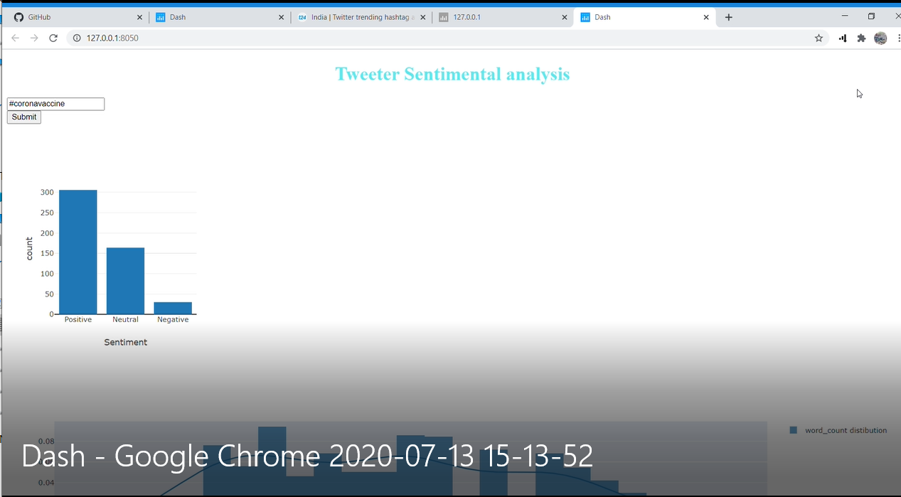

# Twitter Sentimental Analysis 

Simple twitter sentimental anlaysis  to demonstrate sentiment using textblob  and integrating dash core components and http requests. 





# Contents

* ```app.py``` - Front and back end portion of the web application 
* ```models``` - it contains sentimental analysis script .
* ```pred```- conatins sentimental prediction file for twitter #hastag, which we submitted for prediction.
* ```src```- contains raw data file extracted from twitter using tweepy,credential file for twiier account(excluded from git code for security), twiiter extractor script  .

# Installation

* Download the entire repository as a folder and open ```app.py``` and run it with IDE . That's it!
   http://127.0.0.1:5001/
   
# Source: 
 *  https://dash.plotly.com/basic-callbacks
 *  https://developer.twitter.com/en

work in progress >>>>>>>